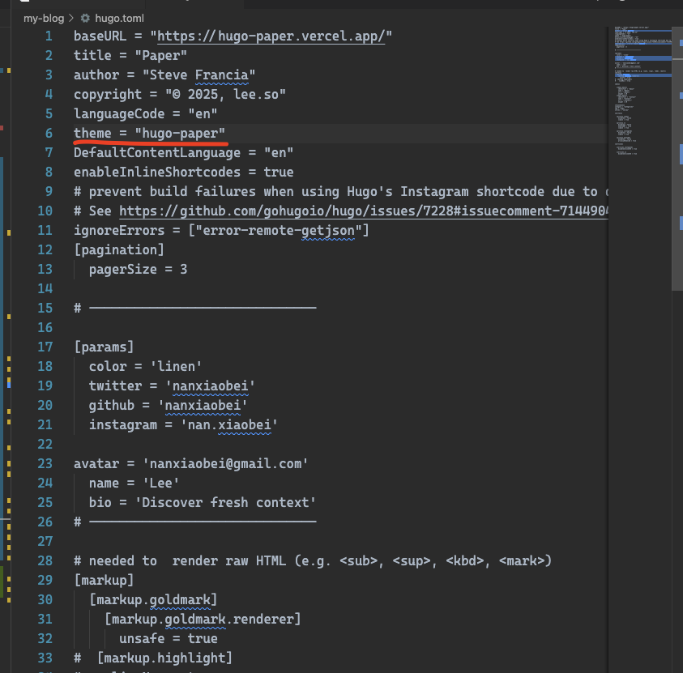
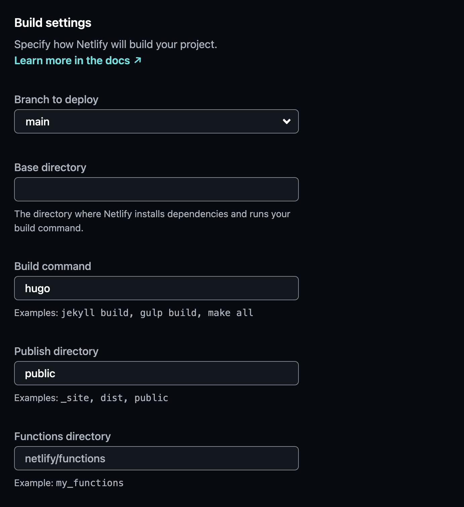
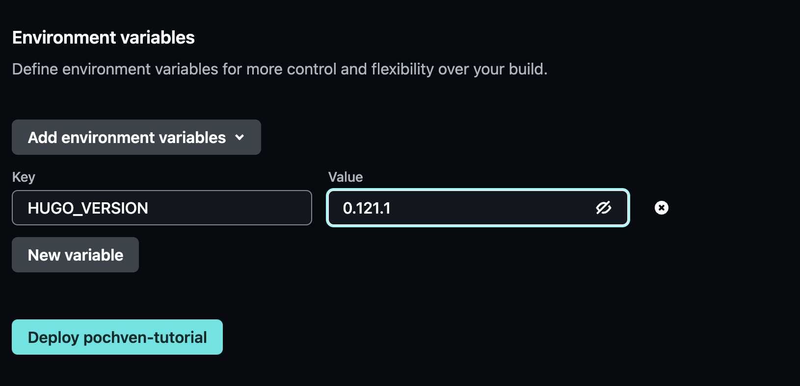
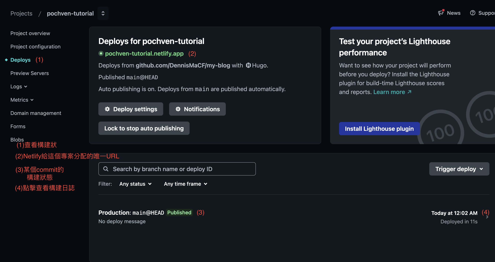

## 前言
在這篇文章中，我將會說明如何使用 [Hugo](https://gohugo.io/) + [GitHub](https://github.com/) + [Netlify](https://www.netlify.com/), 簡單搭建屬於自己的Blog網站。  

> 每个技术人都应该有自己的博客。正如 Github Profile 一样，博客也是一张对外展示的名片。Github 展示了你的开源项目和编码水平，博客则展示了你的思考与技术沉淀。
> --[**Images**](https://imageslr.com/about)

除此之外，作為一名本科系非CS的學生，我視CS為一項興趣，而在寫Blog的過程中，可以讓我有機會接觸到Web開發，並藉此熟悉不擅長的前端技能。  
而申請一個[獨特的域名](#4-申請獨立域名)，搭建一個專屬自己的Blog，你將會擁有完整的自主權，分享獨屬於你的內容。

自建Blog有不少缺點，例如在成為技術大牛前，訪客可能寥寥無幾，互動性也不如社群平台活躍等。  
但以我自己舉例，之所以會想要寫個人Blog，其實是因為在衝浪的過程中，看了許多前輩的Blog，那優質的內容、清晰的邏輯，令我為之著迷，因此萌生了寫Blog的想法。  

而這其中，獲得知名度以及商業收入，其實對我並不重要，更多的則是希望記錄與分享。每一篇Blog，相當於把自己搜集資料、解決問題的過程，濃縮在一篇Blog中，這樣的方式，有助於幫自己釐清思路，還可以作為後來者的參考。  

這也是我選擇自行搭建網站，而不是使用已有內容平台的原因。  

Blog值得長期精心打磨，也能令人眼前一亮。  
如果你也有寫Blog的想法，那就參考以下步驟，花10分鐘打造一個Blog吧。

---

## Start
我們將用 [Hugo](https://gohugo.io/) + [GitHub](https://github.com/) + [Netlify](https://www.netlify.com/) 零成本搭建個人Blog。簡單介紹下原理吧：  

- Hugo 是一個靜態網站生成器，可以將markdown格式的內容轉成HTML，並搭配CSS來設定外觀以及風格，也可以透過HTML框架，來定義網頁的架構與佈局，這裡是一些Hugo社區現成的[主題](https://themes.gohugo.io/)，幫助你快速打造Blog。
- 一個Hugo項目就對應著一個文件夾, 包含了這個Blog的所有內容，如markdown文章、圖片、CSS文件等等資源。
- Hugo 會建構一個純HTML介面。我們可以把它部署到靜態網站託管服務上，便可以在瀏覽器中訪問。
- [Netlify](https://www.netlify.com/) 可以託管靜態網站，是目前主流的選擇。在綁定一個Github repo後，Netlify會自動跟蹤該倉庫的更動、自動完成構建然後發佈。普通用戶每個月有一定的免費額度，作為個人使用綽綽有餘。

### 1. 安裝Hugo環境
> 參考Hugo[官方文檔](https://gohugo.io/installation/)

#### (1) 安裝基本環境  

Mac: [HomeBrew](https://brew.sh/zh-tw/), Windows: [Chocolatey](https://chocolatey.org/)

#### (2) 安裝Hugo:  

mac  
```bash
brew install hugo
```
windows  
```bash
choco install hugo --confirm
```
或是手動下載Hugo執行檔，從Github release 解壓縮到環境變數下  

#### (3) 安裝git(如果還未安裝)  

mac  
```bash
brew install git
```  
windows 直接從[Git官網](https://git-scm.com/downloads/win)下載安裝即可

#### (4) 創建你的第一個Hugo項目  

先從0創建一個新的Hugo專案:  
```bash
hugo new site my-blog
cd my-blog
```
你可以使用社群提供的[主題](https://themes.gohugo.io/)，比如Hugo Paper:  
```bash
git init
git submodule add https://github.com/nanxiaobei/hugo-paper.git themes/hugo-paper
cp -r themes/hugo-paper/exampleSite/* .
```
然後在你的my-blog資料夾中，找到hugo.toml，找到
```toml
theme = "hugo-paper"
```
將它移到   

#### (5) 構建網站：  

```bash
hugo server
```
這會啟動本地預覽伺服器，自動監控內容變動並重新載入頁面  
訪問 `http://localhost:1313` ，即可看到Blog首頁: 
  

#### (6) 準備部署
> Netlify 會自動執行 hugo 指令來構建網站，因此你不需手動執行 hugo。

如果希望可以由Github Pages請執行
```bash
hugo
```
這會將整個網站內容轉換成 HTML、CSS、JS，並輸出到public/ 資料夾，然後就可以上傳到Netlify、Github Pages等平台部署了！

### 2. 將本地倉庫綁定Github遠端倉庫

#### (1) 創建Github倉庫

在Github中，右上角Create New Repository。你會看到:  

Repository Name: 建議為本地資料夾名稱  
此為教學需求所以倉庫設為Private。(正常設置為Public即可)  
剩下的都不用填寫，滑到下面點選Create repository，倉庫就創建完成了。  


#### (2) 推送本地專案到Github  

在Github中找到HTTPS網址並複製，可能像這樣:  
`https://github.com/DennisMaCF/my-blog`  
然後回到`vscode`，先確認你的terminal中所在資料夾，如果不是你的倉庫名稱，請在terminal中輸入:
```bash
cd 你的專案名稱
```
確認完後，請輸入:  
```bash
git add .
git commit -m "first commit"
git branch -M main
git remote add origin https://github.com/DennisMaCF/my-blog.git
git push -u origin main
```
> 在設定完 `git push -u origin main` 後，之後每次推送到遠端只需要輸入: `git push` 即可  

這將會提交變更、設定預設分支與遠端，推送到 GitHub  
你可以到Github上看是否推送成功，大概會變成這樣  
完成以上步驟後  
恭喜你，你的本地專案已經成功綁定遠端倉庫了！  

### 3. 配置 Netlify

#### (1) 訪問[Netlify](https://www.netlify.com/)，直接使用Githun帳號註冊並登入

#### (2) 點擊 Add new project -> import an existing project -> 選擇從 Github 導入專案 -> 填入專案設定如下:  


> 以專案名作為 project name ，可能有人已經使用，選擇一個沒人使用的。  




#### (3) 等待專案首次構建完成:  


#### (4) 點擊劃線部分，便可以使用 Netlify 提供的唯一 `project_name.netlify.app` 鏈接來訪問Blog網站了！  


#### Netlify 常用功能說明:  

- 部署狀態: 



- 域名管理: Project overview -> Domain management  


### 4. 申請獨立域名

> 為何要有獨立域名？獨立的域名是網路上象徵著你個人的符號。相比於Netlify的`netlify.app`，個性化的域名更有個人色彩，便於記憶與分享。
另一方面，域名是一個方便的定位器，當我們想要從Netlify遷移到其他平台部署時，只需要修改指向，而不需要重新保存一個新連結。  
-- 節錄自[【程序员】使用 Netlify + Jekyll 快速搭建个人博客](https://imageslr.com/2023/jekyll-netlify#%E4%BA%94%E7%94%B3%E8%AF%B7%E7%8B%AC%E7%AB%8B%E5%9F%9F%E5%90%8D) 

申請域名只需要選擇一個服務商，並搜索喜歡的域名註冊情形，是否被註冊、付費。知名的有GoDaddy, Namecheap。
域名付費一般以年為單位。
域名註冊完成後，可以在 Netlify 中的 Domain management 來指向自己的Blog。 

---

## 補充： 使用 Markdown 編寫內容

### Markwon 是什麼？為何選擇它？

在開始寫 Blog 前，我猶豫了很久該用什麼工具來寫內容。Word？Notion？還是直接用 Google Docs？後來發現，對於想自己架站、又不想學一堆後台系統的我來說，Markdown 簡直是救星。

Markdown 是一種輕量的純文字語法，基本上只要學會幾個符號，就能把標題、列表、程式碼塊、超連結標起來。例如：  

```md
## 這是一個標題
- 這是一個項目
[連結文字](https://example.com)
```

常用的標記符號也就幾個，幾分鐘就能上手。具體可以通過這兩篇學習:  
1. [少数派：认识与入门 Markdown](https://sspai.com/post/25137) 
2. [什麼是MarkDown - HackMD](https://hackmd.io/@eMP9zQQ0Qt6I8Uqp2Vqy6w/SyiOheL5N/%2FzMIQV80gSiGGkKk1sa8HZA)  

最棒的是，Markdown 可以直接被 Hugo 編譯成網頁，用 GitHub 管理版本，用 Netlify 一鍵上線，一整套流程乾淨又高效，對沒有基礎的小白們來說，非常容易上手。

---

## 結語
在我看來，搭建Blog是簡單的，但是持續輸出才是難點。這是我的第二篇Blog，花了我近一天的時間完成，可見其費時。
最後，希望與大家一起進步，共勉之！